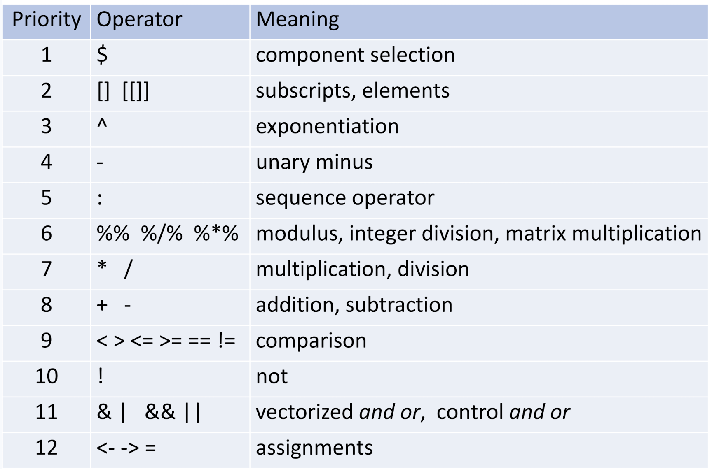

# Chapter 1 Markdowns
By @TNTprizz80315.


# How to install R
For Mac users, you can use homebrew to install R by `brew install R` directly.  
For other users, go Google yourself.

# Declaring a variable:
```R
x <- "something"
x
```
Output:
```
"something"
```
---
While you could also use `=`, it would be "local" only.  
`<-` declaration is global fyi, which would be more commonly used.

# Vectors

## Create a "Vector":
```R
1:5
```
or
```R
c(1, 2, 3, 4, 5)
```
Output:
```
[1] 1 2 3 4 5
```
---
This creates a vector with parameters 1, 2, 3, 4, 5

## Some functions
Length of a vector
```R
length(0:9)
```
Output:
```
[1] 10
```
---
Mode of a vector
```R
mode(1:5)
```
Output:
```
[1] "numeric"
```
---

## Interprete a Vector
We use `x` as an example vector:
```R
x <- 1:3
```
### Do comparison
```R
x < 3
```
Output:
```
[1] TRUE TRUE FALSE
```
### Store the results
```R
y <- (x < 1)
mode(y)
```
Output:
```
[1] "logical"
```
Note that although y contains boolean, it is still a vector.

### *Why not trying out this using characters?*
```R
x <- c("C", "L", "S")
x
mode(x)
```
Output:
```
[1] "C" "L" "S"
[1] "character"
```

### Combining 2 or more vectors together
```R
x <- 1:3
y <- 0:2
z <- c(x, y) # z is a combination of vectors x and y
z
c(z, x)
```
Output:
```
[1] 1 2 3 0 1 2
[1] 1 2 3 0 1 2 1 2 3
```
---
Combining different data types into one vector is possible.
```R
b <- c("C", "L", "S")
c(x, b)
```
Output:
```
[1] 1 2 3 "C" "L" "S"
```

## Getting Vector items
We use `x` as an example vector:
```R
x <- 1:3
```

### Get the 1st element of the vector
```R
x[1]
```
```
[1] 1
```
**NOTE: the element number starts from 1 but not 0**  

Don't do this:
```R
x[0]
```
Output: *(returns nothing)*
```
integer(0)
```

### Get the 1st and 2nd element of the vector
Considering a vector as an input:
```R
x[1:2]
```
Output:
```
[1] 1 2
```


### Filtering Vector Items
This get the items satisfying the statement `x==2`
```R
x[x==2]
```
Output:  
```
[1] 2 
```

### Output as numeric instead of numeral string
```R
y <- c("1", "2", "3")
as.numeric(y)
```
Output:
```
[1] 1 2 3
```

## Generating a Vector Using Functions

### Sequence
`seq(from, to, by)`  
For instance:
```R
seq(from = 0, to = 50, by = 25)
# seq(0, 50, 25) # Omitting the parameter names.
```
Output:
```
[1] 0 25 50
```
This generates a vector from 0 to 50, with an interval of 25.


### Repeat
`rep(x, times, each)` Where `x` is a vector.  
For instance:
```R
rep(x = 1:2, times = 2, each = 2)
# rep(1:2, 2, NA, 2) # Omitting the parameter names
```
Output:
```
[1] 1 1 2 2 1 1 2 2
```
This generates a vector repeating each items 2 times, repeating the previous outcome 2 times also.  
As the 3rd slot is some parameter else, we use `NA` to use the default value.

---
*How about using vectors as parameters?*
```R
rep(1:2, c(4, 2))
```
Output:
```
[1] 1 1 1 1 2 2
```
This repeats the first item for 4 times and the second for 2 times. *Pretty smart move.*


# Matrix
## The function
Let's start by the syntax:  
`matrix(data, nrow, ncol, byrow)`

### An example
Declare a 3x4 matrix:
```R
m <- matrix(1:12, nrow = 3, ncol = 4)
m
```
Output:
```
        [, 1]   [, 4]   [, 7]  [, 10]
[1, ]       1       4       7      10
[2, ]       2       5       8      11
[3, ]       3       6       9      12
```


## Related functions

### Dimention of a matrix
```R
dim(m)
```
Output:
```
[1] 3 4
```
Indicates that m is a 3x4 matrix.

### Number of columns and rows
```R
nrow(m)
ncol(m)
```
Output:
```
[1] 3
[1] 4
```
Indicates that m has 3 rows and 4 columns.

### Extracting elements as vectors
```R
m[2, ] # The 2nd row of the matrix
m[, 3] # The 3rd column of the matrix
```
Output:
```
[1] 2 5 8 11
[1] 7 8 9
```

### Getting a part of a matrix
Get the first 2 rows and last 3 columns of the matrix
```R
m[1:2, 2:4] # 
```
Output:
```
        [, 1]   [, 2]   [, 3]
[1 ,]       4       7      10
[2 ,]       5       8      11
```
---
Exclude the second row of the matrix
```R
m[, -2] # 
```
Output:
```
        [, 1]   [, 2]   [, 3]   [, 4]
[1 ,]       1       4       7      10
[2 ,]       3       6       9      12
```

### Get an element
Get the first col and row item of the matrix
```R
m[1, 1]
```
Output:
```
[1] 1
```

## Combining 2 matrices together
```R
m <- matrix(1:12, nrow = 3, ncol = 4)
m1 <- matrix(1:8, nrow = 2, ncol = 4) # 2, 4
m2 <- matrix(1:6, nrow = 3, ncol = 2) # 3, 2
```
---
rowbind, Append to the bottom of the matrix.
```R
rbind(m, m1)
```
Output:
```
        [, 1]   [, 2]   [, 3]   [, 4]
[1, ]       1       4       7      10
[2, ]       2       5       8      11
[3, ]       3       6       9      12
[4, ]       1       3       5       7
[5, ]       2       4       6       8
```
---
colbind, Append to the right of the matrix
```R
cbind(m, m2)
```
Output:
```
       [, 1]  [, 2]  [, 3]  [, 4]  [, 5]  [, 6]
[1, ]      1      4      7     10      1      4
[2, ]      2      5      8     11      2      5
[3, ]      3      6      9     12      3      6
```

## 3D/Multi dimentional "Array"
This is a matrix with 3, 3, 3 as dimention
```R
n <- array(data = 1:27, dim = rep(3, 3)) # 
n
```
Output:
```
, , 1                   , , 2                     , , 3                     
     [, 1] [, 2] [, 3]         [, 1] [, 2] [, 3]         [, 1] [, 2] [, 3]
[1, ]    1     4     7  [1, ]     10    13    16  [1, ]     19    22    25
[2, ]    2     5     8  [2, ]     11    14    17  [2, ]     20    23    26
[3, ]    3     6     9  [3, ]     12    15    18  [3, ]     21    24    27
```
# List

## The function
`list(*args)`  
It can store multiple objects even with different data types.
```R
w <- list(matrix(1:9, nrow = 3, ncol = 3), c("A", "B"), 1:3)
w
```
Output:
```
[[1]]
     [,1] [,2] [,3]
[1,]    1    4    7
[2,]    2    5    8
[3,]    3    6    9

[[2]]
[1] "A" "B"

[[3]]
[1] 1 2 3
```
## Geting the elements of a list
```R
w[[1]]
```
Output:
```
     [,1] [,2] [,3]
[1,]    1    4    7
[2,]    2    5    8
[3,]    3    6    9
```

### *Or lets have fun having a list in a list.*
```R
z <- list(list("A", "D", list("Easter eggs")), list("B", "C"))
z[[1]][[3]][[1]]
```
Output:
```
[1] "Easter eggs"
```

## Assigning alias
```R
names(w) <- c("m", "c", "v")
```
`[[1]]` is now assigned a name "m", use `<list>$<name>` to call it.
```R
w$m
```
Output:
```
     [,1] [,2] [,3]
[1,]    1    4    7
[2,]    2    5    8
[3,]    3    6    9
```
---
Contents of the list:
```R
w
```
Output:
```
$m
     [,1] [,2] [,3]
[1,]    1    4    7
[2,]    2    5    8
[3,]    3    6    9

$c
[1] "A" "B"

$v
[1] 1 2 3
```

## Unlisting items
```R
u <- unlist(w)
u
```
Output:
```
 m1  m2  m3  m4  m5  m6  m7  m8  m9  c1  c2  v1  v2  v3
"1" "2" "3" "4" "5" "6" "7" "8" "9" "A" "B" "1" "2" "3"
```


# Data frame
## An example: Women
Note: "women" is somehow an example of a data frame built in R
```R
women
```
|   | height| weight|
|--:|--:    |--:    |
|1  |     58|    115|
|2  |     59|    117|
|3  |     60|    120|
|4  |     61|    123|
|5  |     62|    126|
|6  |     63|    129|
|7  |     64|    132|
|8  |     65|    135|
|9  |     66|    139|
|10 |     67|    142|
|11 |     68|    146|
|12 |     69|    150|
|13 |     70|    154|
|14 |     71|    159|
|15 |     72|    164|

## Extract a specific column
```R
women$weight
```
Output:
```
[1] 115 117 120 123 126 129 132 135 139 142 146 150 154 159 164
```

## Filtering
```R
women$height[women$weight > 142]
```
Output:
```
[1] 68 69 70 71 72
```

## Do calculation
`with(source, statement)`  
### Example
```R
with(women, weight / height)
```
Output:
```
[1] 1.982759 1.983051 2.000000 2.016393 2.032258 2.047619 2.062500 2.076923
[9] 2.106061 2.119403 2.147059 2.173913 2.200000 2.239437 2.277778
```

## Data frame [""] vs [[]] vs $

`[""]`: You will need to input the full name of the column  
Outputs as a data frame

`[]`: Only numbers are allowed as parameters  
Outputs as a data frame

`$`: You don't need to complete the column name  
Outputs as a vector

`[[]]`: Only numbers are allowed as parameters  
Outputs as a vector

## Creating a data frame
`data.frame(**kwargs)` (kwargs stands for sth like `x = y`, `a = b`, take vectors as parameters.)
### An example
```R
member <- data.frame(
  name = c("Mr. Apple", "LuzeriA", "Orangestar"),
  song = c("GENOCIDER", "RENDA JOCKEY", "Uz")
)
member
```
|   |     name|         song|
|--:|--:      |--:          |
|1 | Mr. Apple|    GENOCIDER|
|2 |   LuzeriA| RENDA JOCKEY|
|3 |Orangestar|           Uz|


# Factor
## The function
`factor(x)`  
Especially useful if you have a lot of repeated items in a vector (Save resources)

### An example
The following indicates the states of the light switches.
```R
grp <- c("on", "off", "on", "off", "50/50", "off")
grp
grp <- factor(grp)
```
Output:
```
[1] "on"    "off"   "on"    "off"   "50/50" "off"
[1] on    off   on    off   50/50 off
Levels: 50/50 off on
```

## Factor using Integer identifier
```R
as.integer(grp)
```
Output:
```
[1] 3 2 3 2 1 2
```

## Only get a vector of levels
```R
levels(grp)
```
Output:
```
[1] "50/50" "off"   "on"
```

## Redefine the levels
```R
levels(grp) <- c("0.5", "0", "1")
grp
```
Output:
```
[1] 1   0   1   0   0.5 0
Levels: 0.5 0 1
```

## Do logical statements
```R
grp == "0.5"
```
```
[1] FALSE FALSE FALSE FALSE  TRUE FALSE
```

# Mode vs Class

## Mode
Mode describe the data type  
i.e. What the data is, can be text or number
## Class
Class describe the object class  
i.e. How the data is stored, like in the form of matrix


# Approximate storage of numbers
As computers has skill issues, its presentation of floats might be not accurate. 
## An example
```R
n <- 1:10
1.25 * (n * 0.8) - n # Note that 1.25 * 0.8 = 1
```
Expected output: *all 0s*  
Actual output:
```
[1] 0.000000e+00 0.000000e+00 4.440892e-16 0.000000e+00 0.000000e+00
[6] 8.881784e-16 8.881784e-16 0.000000e+00 0.000000e+00 0.000000e+00
```
The error can be observed especially when the result of the operation is somehow limited to a certain value.


# Missing values NA
`NA` means this value is **N**ot **A**pplicable. You can create a vector with no values using that.
```R
x <- NULL
x[seq(2, 10, 2)] <- seq(2, 10, 2)
x
```
Output:
```
[1] NA  2 NA  4 NA  6 NA  8 NA 10
```

## detecting NA items
```R
is.na(x)
```
Output:
```
[1]  TRUE FALSE  TRUE FALSE  TRUE FALSE  TRUE FALSE  TRUE FALSE
```

## Using `!` to achieve `isnot.na()`
```R
!is.na(x)
```
Output:
```
[1] FALSE  TRUE FALSE  TRUE FALSE  TRUE FALSE  TRUE FALSE  TRUE
```
---
Which allow us to skip the `NA` arguments of a vector:
```R
x[!is.na(x)]
```
Output:
```
[1]  2  4  6  8 10
```

# Operators
Self-explanatory.

*Tips: use brackets to ensure clarity!*

# Built-in functions
There are a lot of pre-built functions in R. Avoid using them as variable names or your program will explode.

## Using a built-in function:
`[function name](args, **kwargs)`
```R
round(c(3.14, 5.23, 7.777), digits = 1)
```
Output:
```
[1] 3.1 5.2 7.8
```