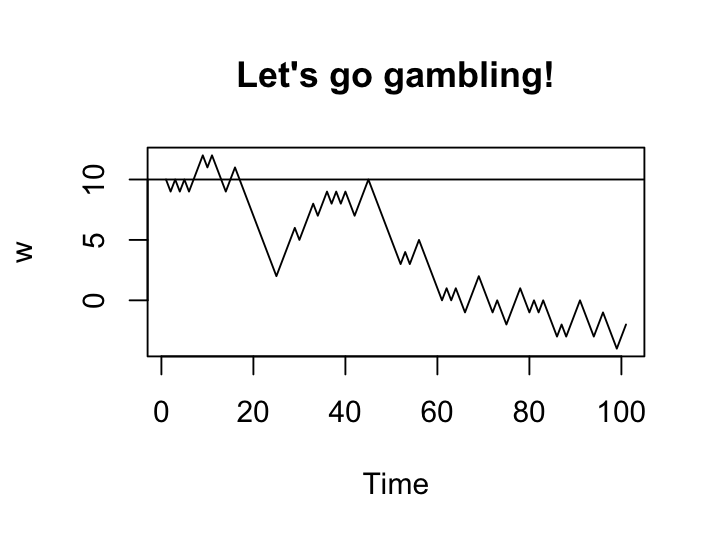
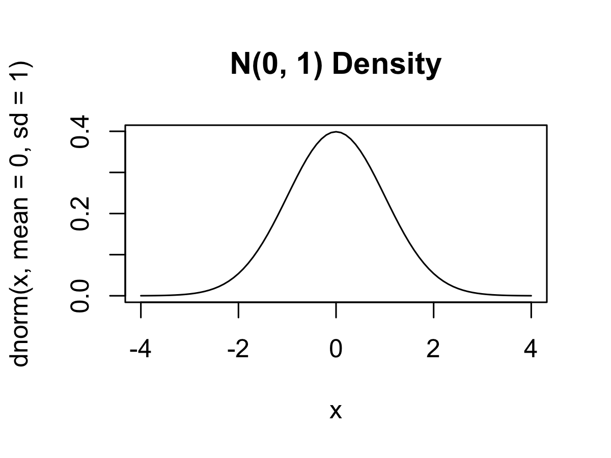
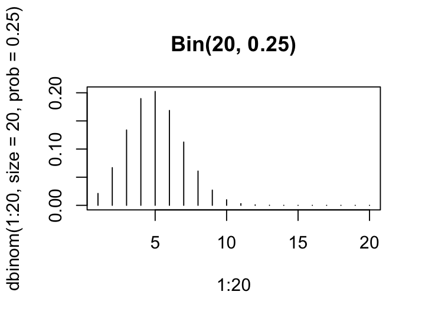
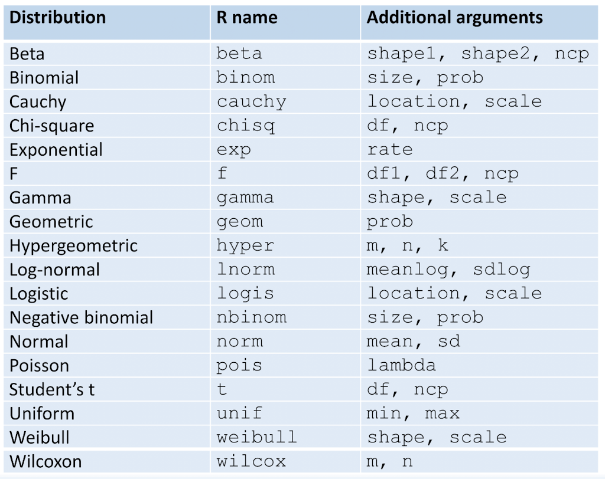
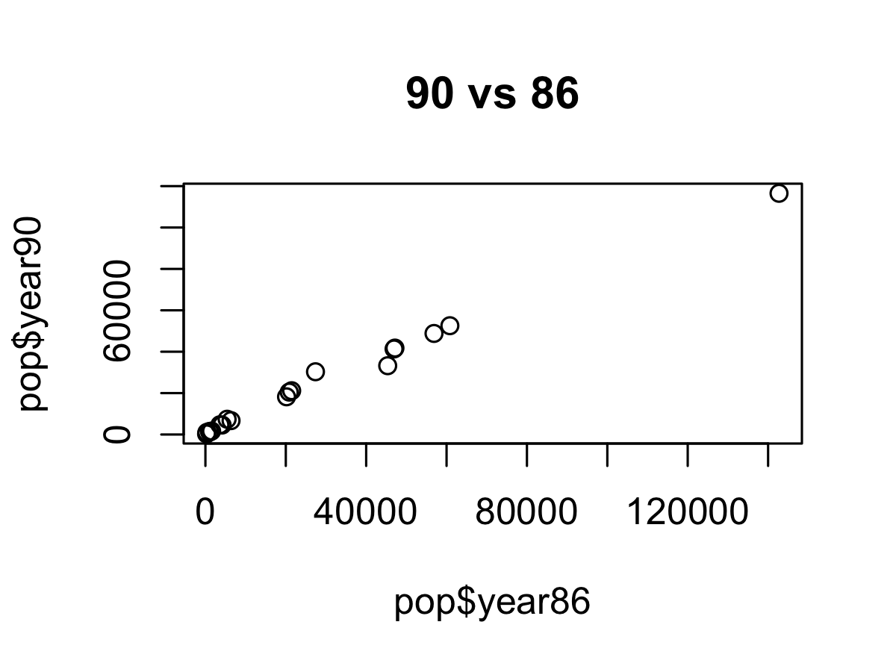

# Chapter 2 Markdowns
By @TNTprizz80315.

# Simulation
Computers are useful because it can do repetitive works using commands.  
R, as a statistical programing language, can tell the computer to generate a lot of sample numbers randomly.  
We can generate **pseudorandom numbers** using R.

## Pseudorandom numbers
The numbers are not exactly random, but generated by an algorithm.  
In spite of that, it is enough for testing purposes.

### Seed
Pseudo numbers are generated based on a seed. The same seed generates an exactly same set of numbers.  

Initiating a seed:
```R
set.seed(114514)
sample(10)
sample(10)
```
Output:
```
[1]  9  1 10  3  8  6  4  5  2  7
[1]  3  2  1  8  4  9  6  7  5 10
```
Running the code above again will lead to the same output. You can try it out yourself.  

This shows that the generation of the numbers depends on the seed, but not completely random.

### Function
`sample(x, size, replace, prob)`  
Generates `size` samples in `x` with the given probability `prob`.  
Do `replace = TRUE` if you allow replacement.

Generating a random permutation from 1 to 10
```R
sample(10)
```
Output: *Randomly generated*
```
[1]  1  9  5  7  3  6  8  2  4 10
```
You can observe different outcomes everytime you run the command.

---
Let's enable replacement:
```R
sample(10, replace = TRUE)
```
Output: *Randomly generated*
```
[1]  2  3 10  5  5  3  9  7 10  1
```

___
How about defining all the possible outcomes and their probabilities?
```R
sample(c(-1, 0, 1), size = 20, prob = c(0.25, 0.5, 0.25), replace = TRUE)
```
Output: *Randomly generated*
```
[1]  0  0 -1 -1  1  1  1  0  1  0 -1 -1  1  0  0  0  1  1  1  0
```
The outcome's probability is as follows:
|Outcome|Probability|
|------:|----------:|
|-1|0.25|
|0|0.5|
|1|0.25|

---
### Generating a massive number of samples
In practice, we often generate a large amount of samples in order to obtain a favourable outcome.  

Let's generate like 10000 samples.
```R
sam <- sample(c(-1, 0, 1), size = 10000, prob = c(0.25, 0.5, 0.25), replace = TRUE)
```
Calculate the proportion of `1`, `0` and `-1` respectively.
```R
sum(sam == 1)/10000
sum(sam == 0)/10000
sum(sam == -1)/10000
```
Output: *Randomly generated*
```
[1] 0.2555
[1] 0.5025
[1] 0.242
```
*Note: The result tends to approach `0.25`, `0.5` and `0.25` respectively, if the sample size is sufficiently large.*  
*The number varies due to sampling error.*

### An example: random walk

Let's say we are playing a game, in which we tosses coins.  
we win $1 if we get a head and lose $1 if we get a tail.  

We can make use of the `sample()` function to simulate 100 or more tosses,  
given that we have $10 initially,  
we will know how many money are left after the simulation.

```R
r <- c(10, sample(c(-1, 1), size = 100, replace = TRUE, prob = c(0.5, 0.5)))
# Basically stating that we have $10 initially.
sum(r)
```
Output: *Randomly generated*
```
[1] -2
```
We can see that we lost $12 in this simulation.  
*You can try it yourself if you love gambling.*  

---

We can observe the amount of money we have for each coin toss using `cumsum()`
```R
cumsum(r)
```
Output: *Randomly generated*
```
[1] 10  9 10  9 10  9 10 11 12 11 12 11 ......
```

---

Let's plot a graph based on this simulation!

```R
w <- as.ts(cumsum(r))
plot(w, main = "Let's go gambling!")
# Ah Damn, Ah damn, Ah Damn
abline(h = 10)
```
Let me explain what are the above codes doing.  

`as.ts()` stands for **as** **t**ime **s**eries, which saves the vector object as a *time series* object, as the amount of money we have varies when we toss the coin.

`plot()` simply plots a graph based on the given objects. The `main` parameter states the title of the graph.

`abline()` **a**dds a **b**lue **line** into the graph. `h = 10` stands for a horizontal line at 10.

Output: *Randomly generated*  


## Uniform distribution
`runif(n, max, min)`  
This generates a uniform number on the interval $[min, max]$, that is:
```math
X \sim U(max, min)
```
Where $X$ is obviously a random variable.

Note that `max` and `min`'s defalut values are `1` and `0` respectively.  

___
Generating 5 uniform numbers on the interval $[0, 1]$
```R
runif(5)
```
Output: *Randomly generated*
```
[1] 0.71348077 0.65209185 0.12612107 0.05919433 0.57925716
```
___
Generating 5 uniform numbers on the interval $[-5, -2]$
```R
runif(5, min = -5, max = -2)
```
Output: *Randomly generated*
```
[1] -3.926813 -3.206384 -4.575499 -3.525671 -3.270114
```

## Normal distribution
The following functions generate the samples from a normal distribution.  
For the examples below, let
```math
X \sim N(0, 1)
```

### PMF or PDF
`dnorm(x, mean, sd)`  
Gets $P(X = x)$ with the self-explanatory parameters.

Find $P(X = 0.277)$,
```R
dnorm(0.277, mean = 0, sd = 1)
```
Output:
```
[1] 0.3839269
```

### CDF
`pnorm(q, mean, sd)`  
Gets $P(X \leq q)$ with the self-explanatory parameters.

Find $P(X \leq 0.277)$,
```R
pnorm(0.277, mean = 0, sd = 1)
```
Output:
```
[1] 0.6091099
```

### Quantiles
`qnorm(p, mean, sd)`  
Get the quantiles with probability `p` (that is, $\pi_p$) with the self-explanatory parameters.

Find $\pi_{0.25}$,
```R
qnorm(0.25, mean = 0, sd = 1)
```
Output:
```
[1] -0.6744898
```

### Sampling
`rnorm(n, mean, sd)`  
Generates `n` random normal samples with the self-explanatory parameters.

Generate 5 random normal samples,
```R
rnorm(5, mean = 0, sd = 1)
```
Output: *Randomly generated*
```
[1] -1.5878812 -0.7723097 -0.3944988  2.2494892 -0.7675874
```

### Plotting a graph
```R
x <- seq(-4, 4, 0.1)
plot(x, dnorm(x, mean = 0, sd = 1), type = "l", main = "N(0, 1) Density")
```
This plots the graph $y = P(X = x)$ with domain $[-4, 4]$, with an interval of `0.1`.  
The `type = "l"` indicates that the graph is a line, but not points.

Output:  


## Binomial distribution
The following functions generate the samples from a binomial functions
For the examples below, let
```math
X \sim Bin(20, 0.25)
```
In addition, the pmf of a binomial distribution is
```math
P(X = x) = C^{n}_{x}\cdot p^x \cdot (1-p)^{n-x}
```
for $x \in [0, 20] \cap \mathbb{Z}$

### Using the functions
The logic is same as normal distribution, like `dbinom` `pbinom` `qbinom` and `rbinom`  
Let's plot a graph here.  
```R
plot(1:20, dbinom(1:20, size = 20, prob = 0.25), type = "h", main = "Bin(20, 0.25)")
```
`type = "h"` Indicates that the pmf lines is plotted using vertical lines.

Output:  


### Finding the tail probability
By $P(X > 8) = 1 - P(X \leq 8)$, we can simply obtain the tail probability by:
```R
1 - pbinom(8, size = 20, prob = 0.25)
```
Output:
```
[1] 0.04092517
```

### Finding the quantiles
We can find the 0th, 10th, ..., 100th quantiles of X by:
```R
qbinom(seq(0, 1, 0.1), size = 20, prob = 0.25)
```
Output:
```
[1]  0  3  3  4  4  5  5  6  7  8 20
```

## Available distribution algorithms
Here is a table for your reference.   
  
You will have to append leading `d` `p` `q` `r` to the `R name` shown above.

## Monte Carlo simulation

We usually use this method to approximate the mean using the sample mean of some independent samples.

### The theorem
Given that we want to approximate the mean $\mu = E(X)$ by generating $m$ independent samples of $X$:  
```math
\mu \approx \bar{X} = \frac{1}{m}\times\sum_{i=1}^{m}{X_i}
```
The larger the $m$ is, the better the approximation is.  
___
The distribution of the sample mean $\bar{X}$ can be approximated by a normal distribution, parameters as shown below:
```math
\bar{X} \sim N(\mu, \frac{\sigma^{2}}{m})
```
In which $\sigma^{2} = Var(X)$, so that we can contruct approximate confidence intervals for $\mu$.

### Example

If we want to estimate $E(|X|)$`(abs(X))`, where $X \sim N(0, 1)$  
We first create some samples, and use the theorem above to approximate the expected value.
```R
n <- 1000
x <- rnorm(1000)
est <- mean(abs(x)) # Estimation
se <- sd(abs(x))/sqrt(n) # Standard error
ci95 <- c(est - qnorm(0.975) * se, est + qnorm(0.975) * se) # Allow 5% error for comparison
c(est, sqrt(2/pi), ci95)
```
Output: *Randomly generated*
```
[1] 0.7965915 0.7978846 0.7587809 0.8344021
```
The theoretical value of $E(|X|)$ is $\sqrt{\frac{2}{\pi}}$, i.e. `0.7978846`, while our estimation is `0.7965915`.  
The percentage error is `-0.16%` only, which is sufficient for simple analysis.  
The accuracy can be further improved by increasing the number of samples.


# Using External Data
We will have to import external data to R in order to process them, which is quite obvious.  

Data are usually in grid form, with a *record-column* structure.

The most simple data form is the ASCII format, with a file extension of `.dat` or `.txt`

## Working directory
Using `getwd()` can show the current working directory of the active R session.
```R
getwd()
```
___
We can use `setwd(directory)` to set our working directory.
```R
setwd("/Your/Working/Directory/Ch2")
```
Before everything start, remember to put all the files you're gonna use into the working directory.

## Code editing and execution
We can edit a file using `edit(filename)`. This will open the file with a text editor, depending on your system preferences.

We can execute a file using `source("filename", echo = TRUE)`. `echo = TRUE` will verbose the commands to the screen.  
If you want to run the commands without verbose, simply use `source("filename")`.

## Read in a data file
`read.table(filepath, header)`  
Only 2 most commonly used parameters are included. Check `help(read.table)` for more information.


Note that you can also read a `csv` file by   
`read.csv(filepath, header)`

Reading `popden.dat`:
```R
pop <- read.table("popden.dat", header = TRUE)
# pop <- read.csv("popden.csv", header = TRUE)
names(pop)
```
Note that the first row of the file is considered headers if `header = TRUE`.  

Output:
```
[1] "district" "year86"   "year90"   "Region"
```
___
Show the first 6 records of the data:
```R
head(pop)
```
Output:
|  |  district| year86| year90| Region|
|-:|---------:|------:|------:|------:|
| 1|   Islands|    290|    293|     NT|
| 2|  Sai_Kung|    365|   1026|     NT|
| 3|    Tai_Po|   1033|   1496|     NT|
| 4|     North|   1074|   1211|     NT|
| 5| Yuen_Long|   1545|   1664|     NT|
| 6|  Tuen_Mun|   3611|   4711|     NT|
___
Show the last 6 records of the data:
```R
tail()
```
Output:
|  |     district| year86| year90| Region|
|-:|------------:|------:|------:|------:|
|14|     Yau_Tsim|  45355|  33232|     KL|
|15| Wong_Tai_Sin|  46940|  41331|     KL|
|16| Kowloon_City|  47156|  41759|     KL|
|17| Sham_Shui_Po|  56875|  48822|     KL|
|18|    Kwun_Tong|  60826|  52562|     KL|
|19|     Mong_Kok| 142718| 116531|     KL|
___
The imported data is data frame, which can be shown using
```R
class(pop)
```
Output:
```
[1] "data.frame"
```

## Processing data frame

There are several functions related to data processing, similar to SQL queries.

We will use the file `./popden.dat` as an example by importing it:
```R
pop <- read.table("popden.dat", header = TRUE)
```

### Grouping
`split(target, by)`  
Group the items in `target` by a list of factors in `by`. Outputs a list of vectors in factors' name.

For instance, if we want to group the `year86` column by `Region`,
```R
(a <- split(pop$year86, pop$Region))
```
Output:
```
$HK
[1]  6380 20182 20854

$KL
[1]  21464  27387  45355  46940  47156  56875  60826 142718

$NT
[1]  290  365 1033 1074 1545 3611 4159 5402
```
___
We can then do some operations with the grouped data individually.
```R
mean(a$HK)
length(a$KL)
sum(a$NT)
```
Output:
```
[1] 15805.33
[1] 8
[1] 17479
```

### Summarizing
`table(factor)`  
Gives out the frequency count by each `factor` in the record.

Display the frequency of each `Region`:
```R
table(pop$Region)
```
Output:
```
HK KL NT 
 3  8  8 
```
___
`by(cols, factor, func)`  
Summarize the data in `cols` by each `factors` by `func`.

Display the mean by each `Region`:
```R
by(c(pop["year86"], pop["year90"]), pop$Region, colMeans)
```
Output:
```
pop$Region: HK
  year86   year90 
15805.33 15129.67 
--------------------- 
pop$Region: KL
  year86   year90 
56090.12 48213.88 
---------------------
pop$Region: NT
  year86   year90 
2184.875 2795.000
```

### Creating categorical variable
We can define a variable which value varies by the items in a data frame.

This returns `TRUE` if both `year86 > 10000` and `year90 > 10000` for each record:
```R
lop <- (pop$year86 > 10000) & (pop$year90 > 10000)
table(lop, pop$Region)
```
Output:
```
lop     HK KL NT
  FALSE  1  0  8
  TRUE   2  8  0
```
___
Or, using `with()`, we can create a column in a data frame.

`with(frame, exp)`  
Processes the expression in `exp` based on the given `frame`, then output a vector which stores the result.

Append `lop` specified above:
```R
pop$lop <- with(pop,
    (pop$year86 > 10000) & (pop$year90 > 10000)
)
pop[8:11, ]
```
Output:
|  |     district| year86| year90| Region|   lop|
|-:|------------:|------:|------:|------:|-----:|
|8 |      Sha_Tin|   5402|   7378|     NT| FALSE|
|9 |     Southern|   6380|   6701|     HK| FALSE|
|10|     Wan_Chai|  20182|  18209|     HK|  TRUE|
|11| Central/West|  20854|  20479|     HK|  TRUE|

### Grouping and summarizing
`aggregate(*args, frame, func)`  
`*args`: `[col]~[split]`  
Group `col` by `split` in `frame` and summarize them as `func`.

If we want to get the mean of `year86` in each `Region`:
```R
aggregate(year86~Region, pop, mean)
```
Output:
|  | Region|    year86|
|-:|------:|---------:|
|1 |     HK| 15805.333|
|2 |     KL| 56090.125|
|3 |     NT|  2184.875|

___
Processing 2 variables:
```R
aggregate(cbind(year86, year90)~Region, pop, mean)
```
Output:
|  |Region|    year86|   year90|
|-:|-----:|---------:|--------:|
|1 |    HK| 15805.333| 15129.67|
|2 |    KL| 56090.125| 48213.88|
|3 |    NT|  2184.875|  2795.00|

___
Group by 2 items:
```R
aggregate(cbind(year86, year90)~Region+lop, pop, mean)
```
Output:
|  |Region|   lop|    year86|   year90|
|-:|-----:|-----:|---------:|--------:|
|1 |    HK| FALSE|  6380.000|  6701.00|
|2 |    NT| FALSE|  2184.875|  2795.00|
|3 |    HK|  TRUE| 20518.000| 19344.00|
|4 |    KL|  TRUE| 56090.125| 48213.88|

### Plotting a simple graph
We will go through the function itself in Chapter 3.  

Let's simply plot a scatter chart between `year86` and `year90`.
```R
plot(pop$year86, pop$year90, main = "90 vs 86")
```
Output:  

___
Or, plot the same graph but apply the `log` into both data:
```R
plot(log(pop$year86), log(pop$year90), main = "log(year90) vs log(year86)")
abline(lsfit(log(pop$year86), log(pop$year90)))
```
Output:  


### Saving a graph
There are several built-in functions to save the plotted graphs.

`png(path)`, `pdf(path)`, `jpeg(path)`, `bmp(path)`  
Save the resultant graph as `path`. Remember to include the file extension. (`.png` or sth)

Saving the above graph as `a.pdf`:
```R
pdf("a.pdf")
plot(log(pop$year86), log(pop$year90), main = "log(year90) vs log(year86)")
abline(lsfit(log(pop$year86), log(pop$year90)))
dev.off() # Writes out the graph from the buffer
```
Output: [a.pdf](./output/a.pdf)

## Write data from data frame
After processing the data, we would want to save our progress.  

`write.table(table, path)`  
Write `table` into `path` in ASCII format.  
Use `row.names = FALSE` so that R won't add the row numbers into the file.

Save the processed file as `popden(1).dat`:
```R
write.table(pop, file = "popden(1).dat", row.names = FALSE)
```
Output: [popden(1).dat](./output/popden(1).dat)

___
We can also save the file as `csv`:
```R
write.csv(pop, file = "popden(1).csv", row.names = FALSE)
```
Output: [popden(1).csv](./output/popden(1).csv)   

Note that `csv` files can be imported to Excel.
