# Chapter 3 Markdowns
By @TNTprizz80315

# Data Visualization
We went through some of the examples in the previous chapters, like Scatter plot graph.  
In this chapter, we will go through some frequently-used charts.

The functions used to draw the plots are considered "high level", that is, we don't have to worry about where the pixels go. We can get the graph by simply describing the plot we want.

In the following examples, we will use the following source files:  

[popden1.dat](./popden1.dat)  
[Commutating.dat](./Commutating.dat)  
[iris.csv](./iris.csv)  
[stock.dat](./stock.dat)
```R
pop <- read.table("./popden1.dat", stringsAsFactors = TRUE, header = TRUE)
com <- read.table("./Commutating.dat", stringsAsFactors = TRUE, header = TRUE)
iris <- read.csv("./iris.csv")
sto <- read.table("./stock.dat", stringsAsFactors = TRUE, header = TRUE)
```

## Multi-frame graphics
If we want to render multiple charts in a go, we can use the following function:

`par(**kwargs)` *You may use `help(par)` to view all the parameters of a function.*  

`mfrow` `mfcol` Takes a vector as input, states the dimention of the frame.  
Use `mfrow` if you want to fill the frame row by row and vice versa.
___
For example, to create a 2x2 frame:  
```r
par(mfrow = c(2, 2))
# Produces 4 random charts
hist(pop$year86)
hist(pop$lnpd86)
hist(pop$year90)
hist(pop$lnpd90)
```
Output:  
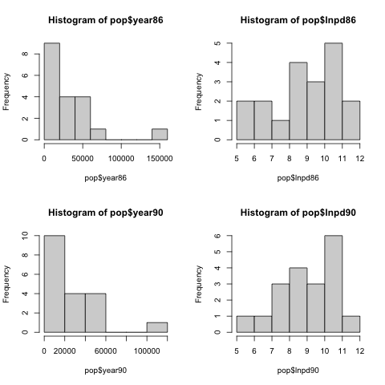

## Adding a line
You can add lines into a chart after rendering a chart.

`lines(x, y, **kwargs)`

`lty` Takes integer or string as input. Determines the line type.
> 0=blank, 1=solid (default), 2=dashed, 3=dotted, 4=dotdash, 5=longdash, 6=twodash  
*--help(par)*  

`lwd` Takes integer as input. Determines the width of the rendered line.
___
Making a dashed line following normal distribution under a random chart:
```r
plot(seq(-12, 12, 0.1), dnorm(seq(-12, 12, 0.1), mean = -5, sd = 1), type = "l", main = "Normal Densities")
lines(seq(-12, 12, 0.1), dnorm(seq(-12, 12, 0.1), mean = 0, sd = 1), lty = 2)
```
Output:  
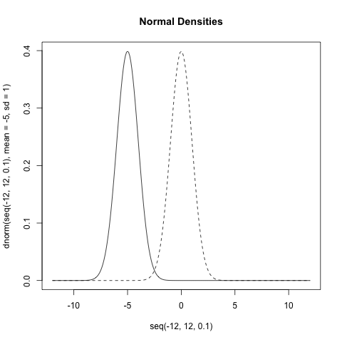

## Histogram
This is a commonly used chart type used to describe the distribution of the data.

`hist(data, **kwargs)`

`freq` Takes boolean as input. If `FALSE`, make a histogram with density instead of frequency.  
`main` Takes string as input. Sets the title of the histogram.  
___
Let's put a normal density line onto the histogram of `lnpd86` and `lnpd90`:
```r
par(mfrow = c(1, 2))
NRange <- seq(5, 12, 0.1)
hist(pop$lnpd86, freq = FALSE)
lines(NRange, dnorm(NRange, mean(pop$lnpd86), sd(pop$lnpd86)), lty = 2)
hist(pop$lnpd90, freq = FALSE)
lines(NRange, dnorm(NRange, mean(pop$lnpd90), sd(pop$lnpd90)), lty = 2)
```
Output:  
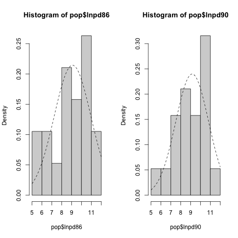

## Pie chart
Yet another commonly used chart type when we want to compare the number of different groups.

`pie(data, **kwargs)`

`labels` Takes a heading as input. Will label the corresponding part of the chart using those.  
`cex` Character expansion factor. Sets the size of the text in the chart.  
`main` Takes string as input. Sets the title of the histogram.  
___
Let's compare the number of people using different transportation methods:
```r
pie(com$Count, labels = com$Commutating, main = "Transportation methods")
```
Output:  
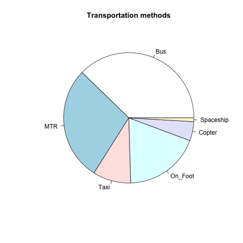

## Bar chart
Effective in comparing different categories.

`barplot(data, **kwargs)`

`horiz` Boolean. Produces a horizontal bar if `TRUE`.  
`col` Takes a colour scheme as input. Colours the bar in the specified colour scheme.  
`xlim` `ylim` Take vectors as input. Define the limits of the data shown in the chart.
___
Let's compare the population distribution with a coloured bar chart:
```r
barplot(pop$lnpd86, horiz = TRUE, col = rainbow(20), xlim = c(0, 25), 
    legend.text = pop$district, 
    args.legend = list(x = 25, y = 23, cex = 0.8),
    main = "log(Population Density) in 1986 Hong Kong"
)
```
Output:  
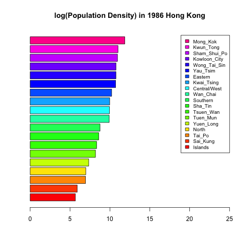
___
How about adding a fancy legend inside the bar and number at the end?
```r
y <- barplot(pop$lnpd90, horiz = TRUE, 
    col = "white", xlim = c(0, 15), 
    main = "log(Population Density) in 1990 Hong Kong"
) # Obtain the y coordinates of each bar generated
x <- round(pop$lnpd90, 1) # Obtain the x coordinates of each data
text(0.5 * x, y, pop$district, cex = 0.8)
text(0.8 + x, y, labels = x, cex = 0.8)
```
Output:  


## Grouped bar chart

We can compare the data in the same group using a grouped bar chart using `barplot` by using a data frame as `data` instead of using a single vector.

`beside` Boolean. If `TRUE`, bars from different groups will be separated instead of sticking together.  
`args.legend` List. Set the properties of the legend in the chart.

For example, if we want to create a grouped bar chart for the population density of 3 Regions in 1986 and 1990 respectively:  
```r
# Compute the sum of each group, then form a 3*2 matrix
lpd <- cbind(by(pop$lnpd86, pop$Region, sum),
    by(pop$lnpd90, pop$Region, sum)
)
par(mfrow = c(1, 2))
barplot(t(lpd), beside = TRUE, horiz = FALSE,
    legend.text = c("yr86", "yr90"),
    main = "log(popden) of Different Years"
) # A vertical grouped barchart grouped by regions.
barplot(lpd, beside = TRUE, horiz = TRUE,
    xlim = c(0, 100), ylim = c(0, 10),
    legend.text = c("HK, KL, NT"),
    args.legend = list(horiz = TRUE, bty = "n"),
    main = "log(popden) of Different Regions"
) # A horizontal grouped barchart grouped by years.
```
Output:  
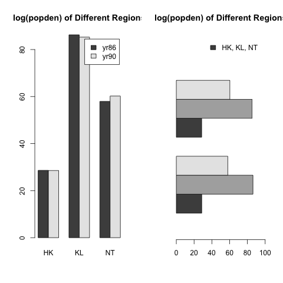

___
What if we want to compare the proportion instead of the exact number?

`prop.table(data, margin = NULL)`

`margin` Integer or Vector.
> a vector giving the margins to split by. E.g., for a matrix `1` indicates rows, `2` indicates columns, `c(1, 2)` indicates rows and columns. When x has named dimnames, it can be a character vector selecting dimension names.  
*--help(prop.table)*

Let's compare the proportion of different region in the 2 years:
```r
par(mfrow = c(1, 2))
barplot(t(prop.table(lpd, 1)), horiz = FALSE, # split by rows
    legend.text = c("yr86", "yr90"),
    main = "Proportion of log(popden) of Different Regions"
)
barplot(prop.table(lpd, 2), horiz = FALSE, # split by columns
    legend.text = c("HK", "KL", "NT"), xlim = c(0, 3), 
    main = "Proportion of log(popden) of Different Years"
)
```
Output:  
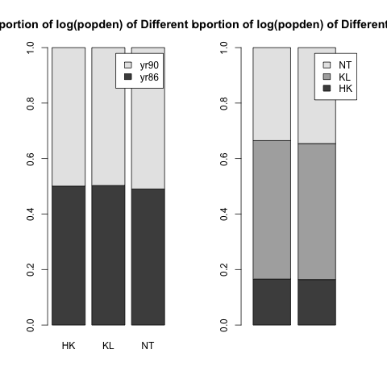

## Quantile-Quantile Plot
You can make use of internal functions to create QQ plots to do comparison with sample data.  

It is impossible for samples to follow a specific distribution in real life. We would just compare the data with the QQ plot line and hope that they matches.

### Normal QQ Plot

This is used to generate a QQ Plot from a set of data.

`qqnorm(data, **kwargs)`

`main` String. The title of the chart.
___
This is used to generate a normal QQ Line from a set of data.

`qqline(data, **kwargs)`

`col` String. The colour of the line.
___
Let's do a normal QQ plot with the data in `popden1.dat`.
```r
par(mfrow = c(2, 2))
qqnorm(pop$year86, main = "Normal QQ Plot for 1986")
qqline(pop$year86, col = "red")
... # Repeat with pop$lnpd86, pop$year90, pop$lnpd90
```
Output:  
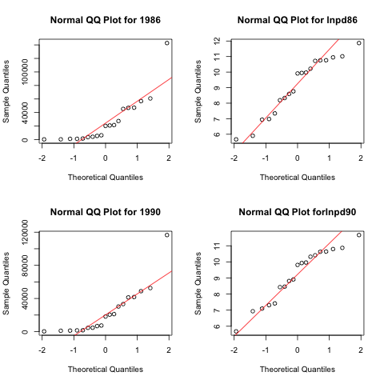

### General QQ Plot

Assume that we don't know `ud` is generated from a Uniform distribution:
```r
ud <- runif(1000, -10, 10)
qqnorm(ud)
qqline(ud, col="red")
```
Output: *Randomly Generated*  
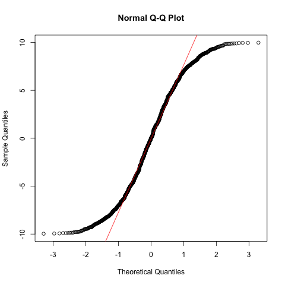  
This shows that it doesn't follow a normal distribution as the lines didn't match.
___
How about making a histogram of it?
```r
hist(ud)
```
Output: *Randomly Generated*  
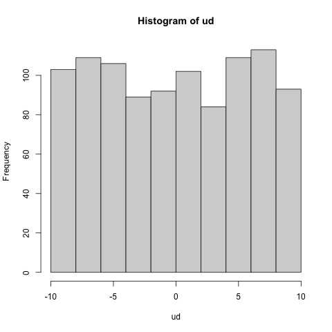  
By observation, this might be a uniform distribution. Let's prove it by creating a line of a uniform distribution with the qqplot for comparison.
```r
n <- length(ud)
uds <- sort(ud)
i <- ((1:n) - 0.5)/n
q <- qunif(i)
plot(q, uds, main = "Uniform QQ Plot") # The sample plot
abline(lsfit(q, uds), col = "red") # The real Uniform distribution line
```
Output: *Randomly Generated*  
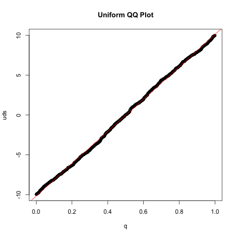  
In which shows that it follows a uniform distribution.

### Normality Tests

 - **Shapiro-Wilk test**: For $n < 50$, have greater power to reject null hypotheses.
 - **Kolmgorov-Smirnox test**: For larger $n$, have lower power to reject null hypothesis.
 - **Anderson-Darling test**: Shapiro-Wilk test, but gives more weight to the tails of the distribution.
 - **Jarque-Beta test**: For $n > 2000$, base on the skewness aod kurtosis of the distribution.

Do note that all tests are imperfect. The results should be compared and processed using graphs like QQ plots.

## Box Plot

Yet another method to show the distribution of data. Comparing the distribution of samples and detecting outliers are possible.

`boxplot(ydata~xdata, **kwargs)`
___
Let's plot a graph which compares the population density of year86 and year 90:

```r
# Prepare the data
yr <- c(rep(86, 19), rep(90, 19))
pd <- c(pop$year86, pop$year90)
lnpd <- c(pop$lnpd86, pop$lnpd90)
# Draw the actual chart
par(mfrow = c(1, 2))
boxplot(pd ~ yr, main = "year86 vs year90")
boxplot(lnpd ~ yr, main = "lnpd86 vs lnpd90")
```
Output:  
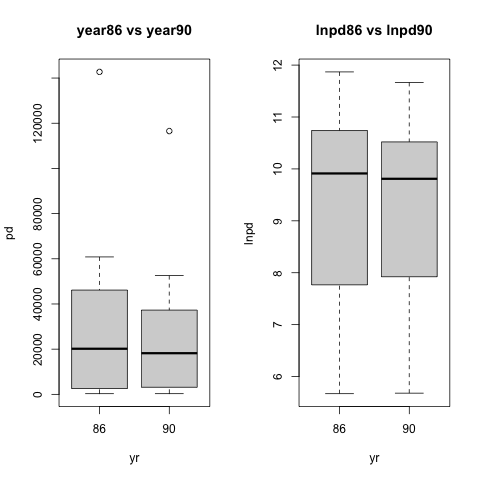  
*Note: you can see the `。` at the top of the `year86 vs year90` chart. This indicates outliers*
___
The horizontal version:
```r
...
boxplot(pd ~ yr, horizontal = TRUE, main = "year86 vs year90")
boxplot(lnpd ~ yr, horizontal = TRUE, main = "lnpd86 vs lnpd90")
```
Output:  
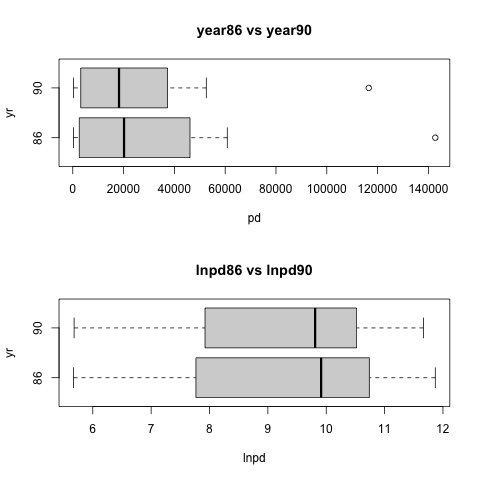

## Grouped Box Plot

We can compare the data by splitting the data.

For instance, compare the population of each `Region`:
```r
# Process the data
s86 <- split(pop$lnpd86, pop$Region)
s90 <- split(pop$lnpd90, pop$Region)
# Draw the actual chart
par(mfrow = c(1, 3))
boxplot(c(s86$HK, s90$HK)~rep(c(86, 90), each = length(s86$HK)), 
    main = "HK", xlab = " ", ylab = " "
)
boxplot(c(s86$KL, s90$KL)~rep(c(86, 90), each = length(s86$KL)),
    main = "KL", xlab = " ", ylab = " "
)
boxplot(c(s86$NT, s90$NT)~rep(c(86, 90), each = length(s86$NT)),
    main = "NT", xlab = " ", ylab = " "
)
# Set the frame back to 1*1 so as to add the title
par(mfrow = c(1, 1))
title(sub = "ln(pd86) vs ln(pd90) by Region")
```
Output:  
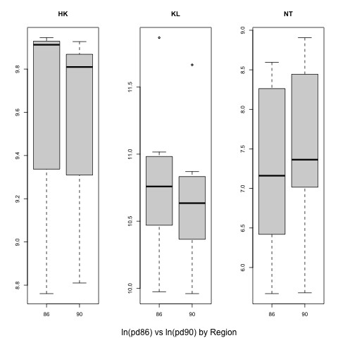
___
Or, compare the population of each `Region`, but separated by `Year`.:
```r
par(mfrow = c(1, 2))
boxplot(lnpd86~Region, data = pop, main = "lnpd86")
boxplot(lnpd90~Region, data = pop, main = "lnpd90")
```
Output:  


## Scatter Plot
Graph used to find the relationship between two variables.  
The variables can be in linear or non-linear relationship, positive or negative correlation.

`plot(xdata, ydata, **kwargs)`

`pch` Integer. Stands for plotting character.  
`bg` `vector[item]` Sets the colour of the dot.
___

For example, plotting the relationship between `lnpd86` and `lnpd90`:
```r
plot(pop$lnpd86, pop$lnpd90, main = "Scatter plot with case numbers")
text(pop$lnpd86 - 0.1, pop$lnpd90 + 0.1, cex = 0.6)
```
Output:  
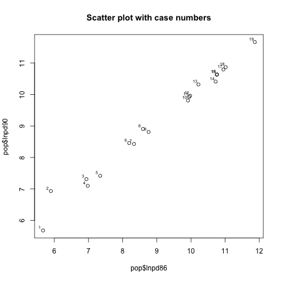

### Identify different point with colours or symbols

Based on different factor levels, we can set a unique colour or symbol for each of them.

For example, making each colour represent each region for every point:
```r
plot(pop$lnpd86, pop$lnpd90, pch = 21,
    bg = c("red", "green", "blue")[pop$Region]
)
```
Output:  
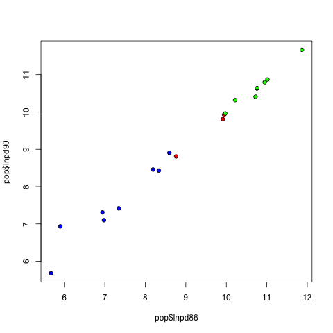
___
Or, use the same symbol for the data which `year86 > year90`, and use another symbol otherwise.
```r
plot(pop$lnpd86, pop$lnpd90,
    pch = c(21, 22)[(pop$year86 > pop$year90) + 1],
    bg = c("red", "green", "blue")[pop$Region]
)
```
Output:  
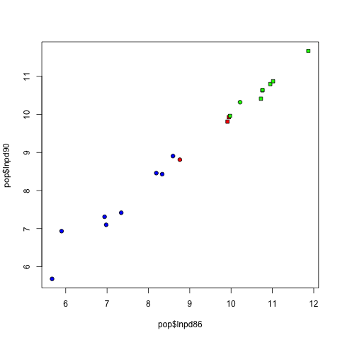

### Matrix Scatter Plot

Let's say we want to compare all combinations possible in a set of data, matrix scatter plot would help in this case.

`pairs(data, **kwargs)`  
`**kwargs` is same as those in `plot()`.

For instance, the famous iris dataset:
```r
pairs(iris[, 1:4],
    pch = 21, bg = c("red", "green", "blue")[iris$Species]
)
```
Output:  
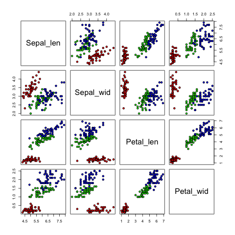

This compares all the properties 2 by 2 for analysis.

## Time Series Plot

`<- as.ts(data)`  
Convert a sequence of vector to time series data. Do directly use it as `data` in `plot()`

For instance, the stock prices of companies:  
```r
par(mfrow = c(3, 1))
plot(as.ts(sto$HSBC))
plot(as.ts(sto$CLP))
plot(as.ts(sto$CK))
```
Output:  
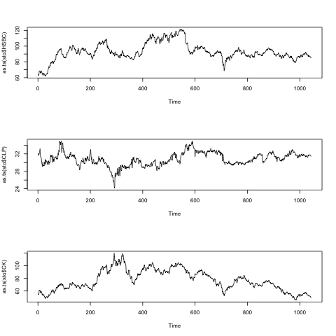

### Plotting the data together

We can get the graphs stick together by merging the data together:
```r
tgt <- cbind(as.ts(sto$HSBC), as.ts(sto$CLP), as.ts(sto$CK))
plot(tgt)
```
Output:  
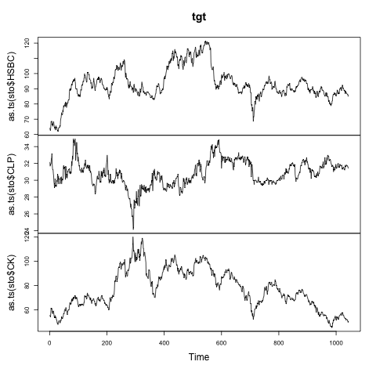  
___
Or, plotting them in the same chart:  
`matplot(data, **kwargs)`  
`**kwargs` is same as that in `plot()`
```r
matplot(tgt, type = "l")
grid() # make a grid.
```
Output:  
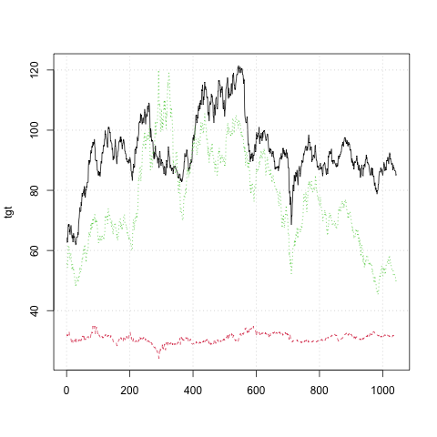

## Mathematics function plot

A method is to get the corresponding x and y values in advance.

For instance:
```math
y = x^3
```

```r
x = seq(-5, 5, by = 0.01)
y = x ^ 3
plot(x, y, type = "l", ylim = c(-125, 125))
```
Output:  
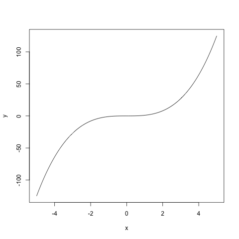
___
Or, using `curve()` function:

`curve(formula, LM, UM)`  
`formula` y = ???  
`LM` `UM` Lower limit and Upper limit of x.

```r
curve(x ^ 3, -5, 5)
```
Output:  
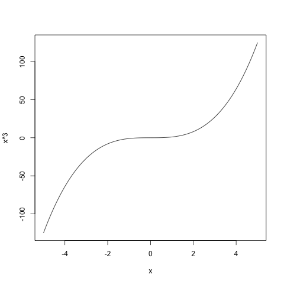  
*literally do the same thing.*

# Low-Level Graphic Functions

## Functions related:

`points(x, y, **kwargs)`  
Add a point into the graph with `x` & `y` coordinates.  

`lines(p1, p2, **kwargs)`  
Add a line segment from `p1` to `p2`, whereas they are vectors representing `c(x-coor, y-coor)`.

`text(x, y, text, **kwargs)`  
Add a piece of text into the graph with `x` & `y` coordinates.  

`abline(a, b, **kwargs)` `abline(x = c, **kwargs)` `abline(y = d, **kwargs)`  
Add a line which $y = a + bx$, $x = c$ & $y = d$ respectively.  
*Note: Using `curve()` would make things easier in those curcumstances.*

`polygon(x, y, **kwargs)`  
Make a polygon with vectors `x` and `y`.  
The coordinates of the points would be represented in the nth items in `x` and `y`.  
For `x = c(0, 1, 2, 0)`, `y = c(0, 0, 1, 0)`, the coordinates of the points of the polygon would be `(0, 0)` `(1, 0)` `(2, 1)` & `(0, 0)`.

`segments` `arrows` `(x0, y0, x1, y1, **kwargs)`  
Make line segments and arrows from `(x0, y0)` to `(x1, y1)` respectively.  

`symbols(x, y, *args, **kwargs)`  
`*args`:  
 - `circles` Set the radius of the circle.
 - `squares` Set the length of the sides of the square.
 - `rectangles` A matrix with 2 columns, set the width and the height of the rectangle respectively.
 - etc. *Check the R help document yourselves. Won't be covered in exam.*

`legend(x, y, legend, **kwargs)`  
Put a legend on `x` & `y` coordinate.  
`legend` `c(texts)[items]`

## Labelling

Refer to this image for the position of margins and lines:  
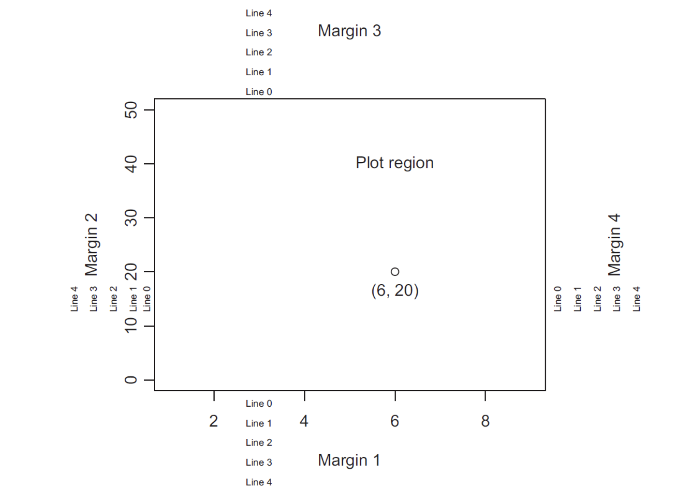

`title(main, sub, x-lab, y-lab, **kwargs)`  
Adds a title to a graph.  
`main` Main title  
`sub` Subtitle  
`x-lab` `y-lab` titles for x-axis and y-axis.

`mtext(text, side, line, **kwargs)`  
Adds a text in a margin.  
`side` `line` The side and line numbers. Refer to the image above.

`axis(side, at, labels, **kwargs)`  
Adds an axis to the graph.  
`side` Refer to the image above.  
`at` The point where the tick mark is shown.  
`labels` The label of the axis.

`box(**kwargs)`  
Add a box to define the border of the plot.

## `**kwargs` commonly used:  
 - `pch` Set the symbols used in plotting.
 - `col` Set the colour of the plot or line.
    - `col.main` Set the colour of the title.
    - `col.axis` Set the colour of the axis.
 - `lwd` Set the width of the line.
 - `lty` Set the style of the line.