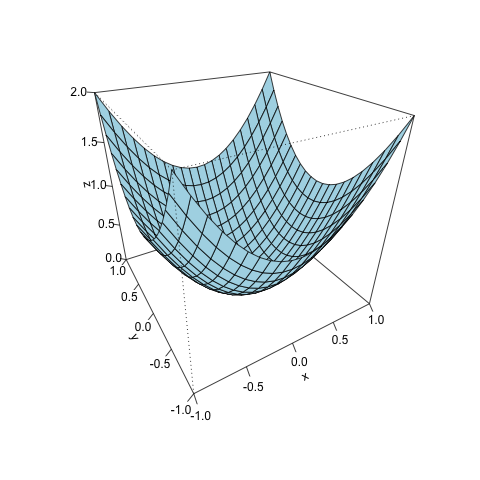

# Chapter 6 Markdowns
By @TNTprizz80315.

# Scientific Computations in R

## Operations

For 
```Math
A = 
\begin{bmatrix}
1 & 2 & 3 & 4 \\
5 & 6 & 7 & 8 \\
9 & 10& 11& 12 \\
\end{bmatrix},
B = \begin{bmatrix}
1 & 1 & 4 & 0 \\
5 & 1 & 4 & 0 \\
1 & 9 & 1 & 9 \\
8 & 1 & 0 & 0 \\
\end{bmatrix}
```
___
`t(matrix)` Transpose a matrix.

`t(A)`:
```Math
A^T =
\begin{bmatrix}
1 & 5 & 9 \\
2 & 6 & 10\\
3 & 7 & 11\\
4 & 8 & 12\\
\end{bmatrix}
```
___
`%*%` Multiplies a matrix.

```Math
AA
```
___
`%o%` Performs outer-product on a matrix.

`A %o% A`:
```Math

\begin{bmatrix}
1 \times 1 & 5 \times 5 & 9 \times 9 \\
\vdots & \vdots & \vdots \\
4 \times 4 & 8 \times 8 & 12 \times 12
\end{bmatrix}
```
___
`%*%` Performs dot product (inner product) if used on vectors.
___
`diag(vector/matrix)` Create a diagonal matrix from the vector. Creates a vector from a matrix with its diagonal values.  
Can be used even if the matrix is not a square matrix.

`diag(1:4)`:
```Math
\begin{bmatrix}
1 & 0 & 0 & 0 \\
0 & 2 & 0 & 0 \\
0 & 0 & 3 & 0 \\
0 & 0 & 0 & 4 \\
\end{bmatrix}
```
```R
diag(diag(1:4))
```
Output:
```
[1] 1 2 3 4
```
___
`det(matrix)` Get the determinant from a matrix.
```R
det(B) 
```
Output:
```
[1] -144
```
___
`solve(A, b)` Solve $A\vec{x} = \vec{b}$. Will get the inverse of `A` if `b` is missing.
___
`uniroot(func, range)` Get the value in `range` where `func = 0`.   
```R
f <- function(x) {x**2 - 1}
uniroot(f, c(0, 2))$root
```
Output:
```
[1] 0.9999997
```
___
`integrate(func, LM, UM)` Do integrations.

```R
f <- function(x) {x**2 - 1}
integrate(f, -1, 1)$value
```
Output:
```
[1] -1.333333
```
___
`D(expr, varname)` Do differenciation and give out the expression.
```R
f <- expression(tan(x))
dfdx <- D(f, "x")
dfdx
x <- pi/9
eval(dfdx)
```
Output:
```
1/cos(x)^2
[1] 1.132474
```
___
`optimize(func, range, maximum = FALSE)` Get the critical points of a function.
```R
f <- function(x) {x**2 - 1}
optimize(f, c(0, 1))$minimum
```
Output:
```
[1] 6.610696e-05
```
___
`optim(init, func)` Do the same thing as `optimize()`, but with multiple inputs.
```R
f <- function(x) {x[1]^2 + x[2]^2}
optim(c(-1, -1), f)$par
```
Output:
```
[1] -4.375219e-05 -7.907415e-05
```
___
`persp(x, y, z, theta, phi, **kwargs)` Make 3D plot with perspectives `theta` and `phi`.
```R
f <- function(x, y) {x^2 + y^2}
x <- y <- seq(-1, 1, by = 0.1)
z <- outer(x, y, f)
persp(x, y, z, theta = -30, phi = 30, col="lightblue", ticktype="detailed")
```
Output:

___
