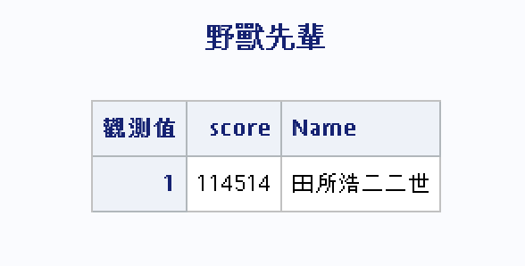

# Chapter 8 Markdowns
By @TNTprizz80315

# Introduction to SAS

## Data Types
Only two: String and Numeric.  
String is just text and numeric is any number form.

Missing value: String = `" "` Numeric = `"."`
## Naming of variables
 - Length of variable better to be less than 8 (or 32 if you use modern versions of SAS)
 - Must start from an alphabetic `^a-zA-Z` or underscore `_`
 - Must only contain alphabetic `^a-zA-Z`, numbers `^0-9` or underscore `_`.
 - Do not use names start and end with `_`.

## Finally, to the real programming!

### Syntax
Every code ends with a semicolon `";"`.  
It is not necessary to use indentations, but is recommended to do so.  
Statements can be in uppercase or lowercase.

### DATA steps
`DATA` defines the data used and process the raw data.
```sas
DATA set1;
    score = 114514;
    Name = "田所浩二二世";
RUN;
```

### PROC steps
`PROC` do the output jobs and process the reslutant data. Use it after `DATA` steps.
```sas
PROC PRINT DATA = set1;
    TITLE "野獸先輩";
RUN;
```
Output:  


### Comments
 - `*comment;` One line
 - `/*comment*/` Multiple lines
