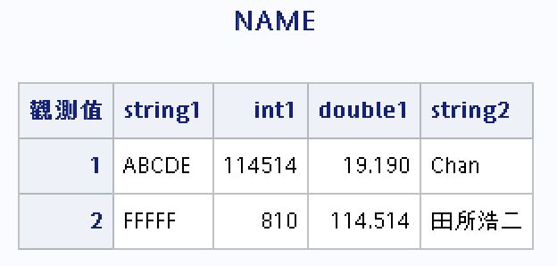

# Chapter 9
By @TNTprizz80315

# SAS: Creating Data Set

## Types

### Temporary Data Sets
Will be deleted when the session ends.  
`WORK` is an example of it.

### Pernament Data Sets
Stored on the computer.

## How it works
Data Sets are stored in a library, which links to a directory in a computer.  
You can get a data set with the syntax `library.setfile`.

## To import it
Use viewtable window/Import Wizard/DATA step.

## Creating a new library
```sas
LIBNAME name 'path';
RUN;

LIBNAME lib1 'C:\libs\lib1';
RUN;
```

## Importing data in DATA step
We use `CARDS;`/`DATALINES;` or `CARDS4;`/`DATALINES4;` to indicate the start of the data.  
`CARDS` data ends with `;`, while `CARDS4` data ends with `;;;;`, used when there are `;`s in the data.

### External text files
```sas
INFILE 'filepath' DLM=',' DSD;
```
This treats the `,` as a separator of each data, and DSD enables missing values between 2 consecutive separators.

### Reading data from text
```sas
LIBNAME lib1 'C:\lib\lib1'; *Import a library if necessary;
DATA lib1.dat1; *Created a set in the lib1 library;
    LENGTH string1 $ 5; *The length of string1 will become 5;
    INPUT string1 $ 1-5 @7 int1 double1 / string2 $ & #1 string3 $;
/*
Rules:
Add $ after a string variable.
Add / if you want to skip to the next line.
Add & after a string variable if the value consists of blankspace. Go to the next variable if there are 2 or more blankspaces.
Add @@ if you want the cursor not skip to the next line for the next input entry.
#n gets you to the n-th data line of the current record.
@n gets you to the n-th column of the current record.
+n Skips n columns.
n-m will read the data in the specific column number. Put after the variable name.
*/
    CARDS;
ABCDE 114514 19.19
Chan
FFFFF 810 114.514
田所浩二  三世
;
RUN;

PROC PRINT DATA=lib1.dat1;
    TITLE "NAME";
RUN;
```
Output:  


*Note: Multiple `INPUT` statements can be made in a single `DATA` step.*

### Informat
It converts the data into a specific format.
```sas
INPUT var informatd.w;
```
The informat ends with `d.w`, where d is the number of decimal places, and w is the total width of the data. Add a period in the informat anyways.

Types:

|Informat|Definition|
|:-------|:---------|
|$CHAR*w*.|Reads characters without removing leading blanks.|
|$UPCADE*w*.|Convert characters into uppercase.|
|$*w*.|Reads character and remove leading blanks.|
|COMMA*w*.*d*|Removes commas and convert brackets into minus values.|
|COMMAX*w*.|Same as COMMA*w*.*d* but reverse the role of periods and commas.|
|PERCENT*w*.|Convert percentages into numbers.|
|*w*.*d*|Reads numeric data.|
|ANYDTDTE*w*.|Reads date.|
|DATE*w*.|`ddmmmyy` `ddmmmyyyy`|
|DATETIME*w*.|`ddmmmyy` `hh:mm:ss`|
|DDMMYY*w*.|`ddmmyy` `ddmmyyyy`|
|JULIAN*w*.|`yyddd` `yyyyddd`|
|MMDDYY*w*.|`mmddyy` `mmddyyyy`|
|STIMER*w*.|`hh:mm:ss.ss` `mm:ss.ss` `ss.ss`|
|TIMEw.|`hh:mm:ss.ss` `hh:mm`|

## Modifying a library
```sas
DATA dat2;
    SET lib1.set1;
    /*Do sth here to modify the data haha*/
RUN;
```
